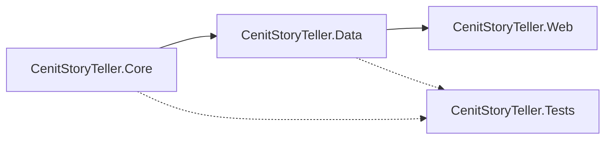
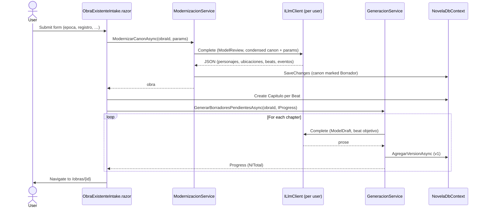
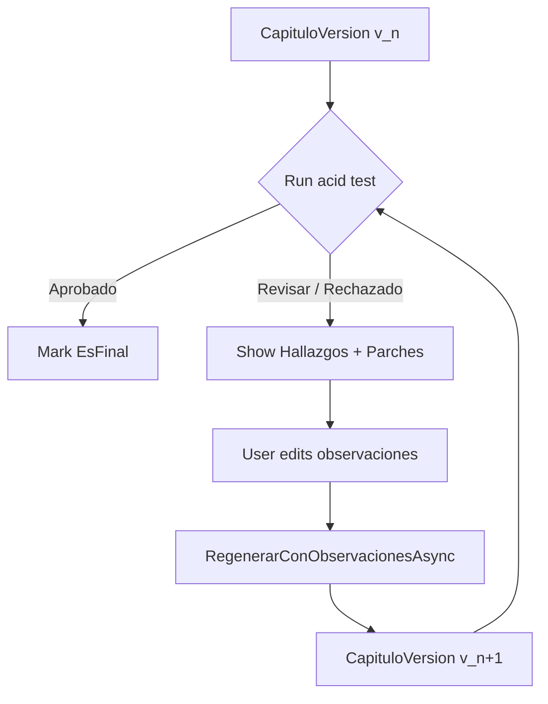
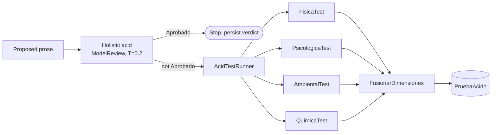
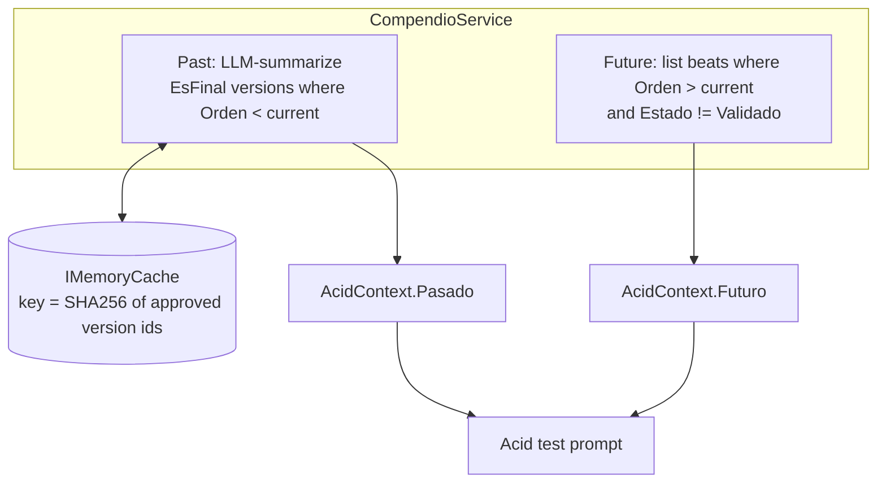
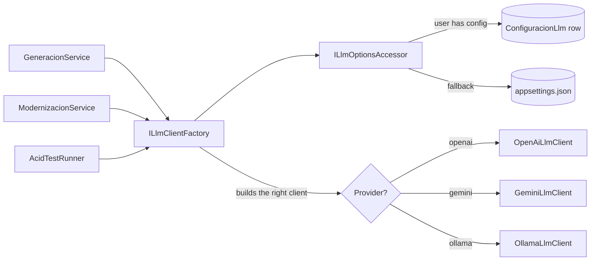
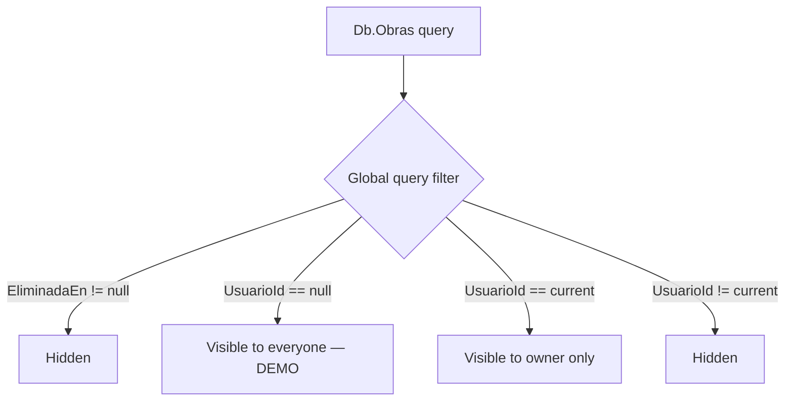
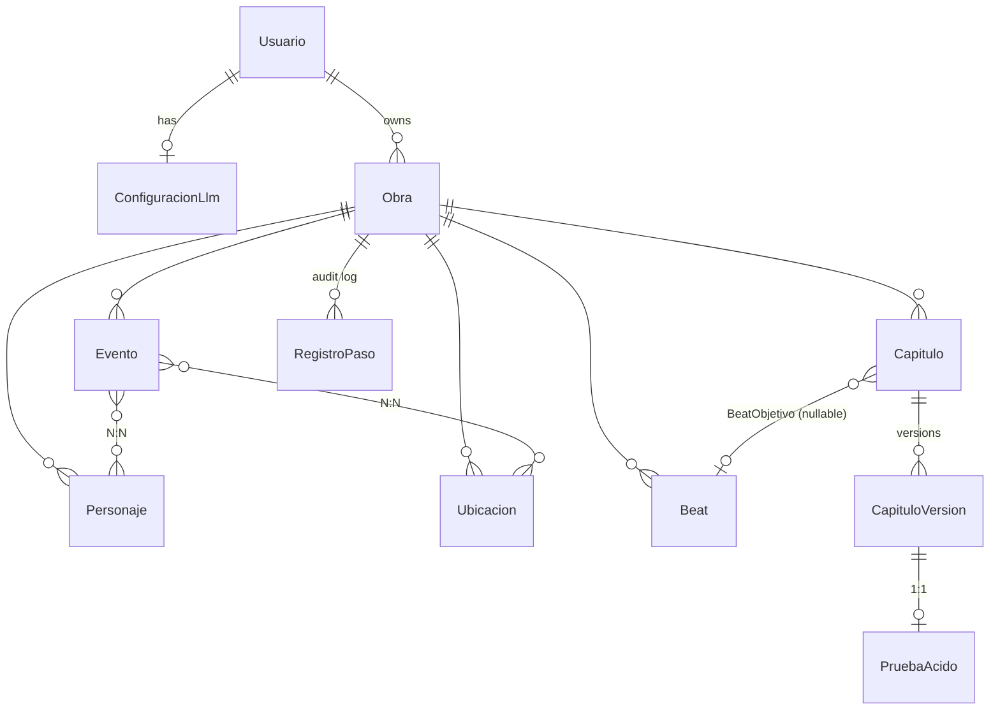

# Architecture

This doc explains how CenitStoryTeller is put together so you can change
it without breaking the things it's good at. If you're just trying to
run the app, start with the [README](../README.md).

## Reading map

1. [The thesis](#the-thesis) — why this exists, what it isn't.
2. [Layout](#layout) — projects, who depends on whom.
3. [End-to-end flow](#end-to-end-flow) — what happens when a user
   modernizes East Lynne, with every component named.
4. [The Acid Test](#the-acid-test) — the four dimensions, the prompt,
   how the verdict is parsed.
5. [The Compendio](#the-compendio) — how the acid test sees the past
   and future of the obra.
6. [LLM provider abstraction](#llm-provider-abstraction) — per-user
   config, factory pattern, swapping providers.
7. [Multi-tenancy](#multi-tenancy) — query filter, demo obras,
   ownership checks.
8. [Customizing the prompts](#customizing-the-prompts) — change the
   creative voice without touching code.
9. [Data model](#data-model) — entities and their relationships.

## The thesis

LLMs hallucinate fluently over long-form narrative: characters speak
out of character, locations contradict themselves, dead people show up
alive, romance arcs appear with no setup. **CenitStoryTeller treats
the LLM as a component, not the author.** Prose is generated against
a persisted canon, and every output is validated across four
dimensions before it counts as written.

What it is *not*:

- Not a chatbot. Each generation is a transactional, auditable event.
- Not provider-locked. OpenAI, Gemini, and Ollama (local) are all
  first-class; new providers add at a single seam (`ILlmClient`).
- Not "magic". Every prompt is a versioned file under
  [`prompts/`](../prompts/). The acid test, the compendio, and the
  story engine are all readable text. You can change them without
  recompiling.

## Layout

```
CenitStoryTeller.Core    ← Pure domain. No DB, no HTTP, no I/O.
  Entities/              ← Obra, Personaje, Ubicacion, Beat, Evento, …
  Llm/                   ← ILlmClient, LlmOptions, OpenAi/Gemini/Ollama
  AcidTests/             ← IAcidTest, AcidTestBase, the 4 dimensions

CenitStoryTeller.Data    ← EF Core + repositories + orchestration.
  Entities/              ← Identity user (lives here, not in Core)
  Repositories/          ← Obra, Capitulo, RegistroPaso, ConfiguracionLlm
  Services/              ← Generacion, Modernizacion, Compendio, Beat
  Seeding/               ← EastLynneSeeder (the demo)
  Migrations/            ← EF migrations

CenitStoryTeller.Web     ← ASP.NET + Blazor Server + Identity + MudBlazor
  Components/Pages/      ← Blazor pages (workspace, configuracion, …)
  Components/Account/    ← Login, Register, etc. (Blazor SSR for cookie auth)
  Endpoints/             ← Minimal API (image upload/serve)
  Email/                 ← Console + SendGrid + Identity bridge
  HttpCurrentUser.cs     ← ICurrentUser impl using ClaimsPrincipal

CenitStoryTeller.Tests   ← xUnit + SQLite in-memory + FakeLlmClient
```

The dependency rule is enforced by the project references: `Web →
Data → Core`. `Core` never references anything domain-specific to the
upper layers.



## End-to-end flow

The "modernize a classic" path touches every component. Here's what
runs when you click "Cargar y Modernizar con IA":



The user gets a per-chapter progress bar through the whole run. Blazor
Server's SignalR connection keeps the page alive across the multi-minute
chain — no background workers, no queue.

After landing in the workspace, the iteration loop kicks in per chapter:



Every step writes a `RegistroPaso` so the bitácora reads end-to-end.

## The Acid Test

Each `IAcidTest` validates one *dimension* of the proposed prose:

| Dimension       | Class              | What it asks                                              |
|-----------------|--------------------|-----------------------------------------------------------|
| **Física**      | `FisicaTest`       | Bodies, injuries, age, vital state. No acting after death.|
| **Psicológica** | `PsicologicaTest`  | Decisions consistent with wound / desire / need. No OOC turns. |
| **Ambiental**   | `AmbientalTest`    | Plausible for the place / era. Lore obeyed.               |
| **Química**     | `QuimicaTest`      | Relationships earned by setup events. No romance from nothing. |



1. The **holistic acid call** uses one LLM request to produce a
   single global verdict (`Aprobado` / `Revisar` / `Rechazado`).
2. If anything's wrong, the **dimensional runner** invokes each
   `IAcidTest` in order. Each test sees the same `AcidContext` but
   focuses on its own slice and returns its own JSON
   `(pasa, hallazgo, parche)`.
3. `FusionarDimensiones` writes each dimension's `pasa` flag onto the
   `PruebaAcido` and concatenates the findings/patches with their
   dimension prefix (`[Fisica] …`).

### The acid prompt

`AcidTestBase` builds the user-side prompt. Each dimension supplies
its own *criterio* (what to check) and *contexto relevante* (the canon
slice it cares about). The base also injects the compendio (next
section) so the model sees past and future, not just the proposed
scene.

The system prompt is the file [`prompts/continuidad-acido.md`](../prompts/continuidad-acido.md).
Edit that to change the validator's voice or output schema.

## The Compendio

Without the compendio, the acid test sees a chapter in isolation. With
it, the validator can spot two real failure modes:

- **Contradicción hacia atrás**: a personaje that died in chapter 3
  can't act in chapter 5.
- **Cierre prematuro**: a romance can't be resolved in chapter 4 if
  beat 9 still depends on the unresolved tension.



- **Pasado** is the only LLM call here, and the result is cached. The
  cache key is a SHA256 of the included version ids. Same approved
  set ⇒ same key ⇒ no LLM call. Approve a new chapter ⇒ hash shifts
  ⇒ cache miss ⇒ regenerate.
- **Futuro** is deterministic text. No LLM, no cache.

`Pasado` uses `ModelDraft` with `Temperature = 0.2` — summarization
should be faithful, not creative.

## LLM provider abstraction



- `ILlmClient` is no longer registered as a long-lived singleton.
  Services inject `ILlmClientFactory` and ask for one when they need
  one. The factory reads the effective `LlmOptions` from the accessor.
- `ILlmOptionsAccessor` has two implementations:
  - `AppsettingsLlmOptionsAccessor` (default, in Core) — global config.
  - `UserLlmOptionsAccessor` (Web/Data, last-registered wins) — looks
    up the current user's `ConfiguracionLlm` row, falls back to
    appsettings when there's no row or no API key.
- Adding a new provider is one `ILlmClient` implementation plus one
  arm in the factory's switch.

## Multi-tenancy



- `Obra.UsuarioId` is nullable. `NULL` means "demo, read by everyone,
  mutated by nobody".
- The query filter in `NovelaDbContext.OnModelCreating` combines soft
  delete with tenancy: `EliminadaEn == null AND (UsuarioId == null
  OR UsuarioId == CurrentUserId)`.
- `ObraRepository` auto-stamps `UsuarioId` on `AddAsync` from
  `ICurrentUser`. Mutators (`Remove`, `EliminarAsync`, `RestaurarAsync`)
  call `AssertMutable`, which throws `UnauthorizedAccessException`
  for demos and for obras belonging to someone else.
- The Identity tables (`AspNetUsers`, etc.) live in the same DbContext;
  `NovelaDbContext` inherits from `IdentityDbContext<Usuario,
  IdentityRole<Guid>, Guid>`.

The tenancy tests in
[`ObraRepositoryTenancyTests.cs`](../tests/CenitStoryTeller.Tests/Repositories/ObraRepositoryTenancyTests.cs)
exercise every visibility / mutability combination.

## Customizing the prompts

Three files under [`prompts/`](../prompts/) drive every LLM call:

| File                          | Used by                  | What it controls                        |
|-------------------------------|--------------------------|------------------------------------------|
| `motor-de-historia.md`        | `GeneracionService`      | Voice and constraints for prose         |
| `continuidad-acido.md`        | Holistic acid test       | Verdict schema and rubric               |
| `moderniza.md`                | `ModernizacionService`   | Transposition rules + output JSON schema |

`FilePromptProvider` (in Data) reads them from disk on every request,
so edits show up without restarting the app. The files are also copied
into the Web project's output directory via `<Content Include="..\..\prompts\**\*.*">`
in the Web csproj, so the Docker image has them too.

Translating the prompts to a different language, or changing the
acid-test rubric (e.g. removing the chemistry dimension), is a text
edit — no recompile.

## Data model



Highlights:

- **`Obra`** is the aggregate root. Soft delete + tenancy are enforced
  by the global query filter — every `Obras` query that doesn't use
  `IgnoreQueryFilters()` already respects both.
- **`Beat` and `Capitulo` share `Orden`** for alignment. `BeatService`
  keeps them in sync when reordering or inserting.
- **`CapituloVersion`** is immutable history. Each generation,
  regeneration, or modernization adds a row; old versions are kept
  for diff.
- **`PruebaAcido`** is 1:1 with a version. The four dimension flags
  + `Hallazgos` + `Parches` + global `Veredicto` are stored verbatim.
- **`RegistroPaso`** is the audit log. Every agent step writes one
  with a snapshot of what canon it saw.

## What to read next

- Run the app with the East Lynne demo, then open
  [`tests/CenitStoryTeller.Tests/Services/`](../tests/CenitStoryTeller.Tests/Services/) — the tests are the
  shortest spec of each service.
- The prompts under [`prompts/`](../prompts/) — the system's
  personality is in there, not in C#.
- `ObraDetalle.razor` is intentionally the messiest file in the
  codebase; a refactor into per-tab components is on the roadmap.
